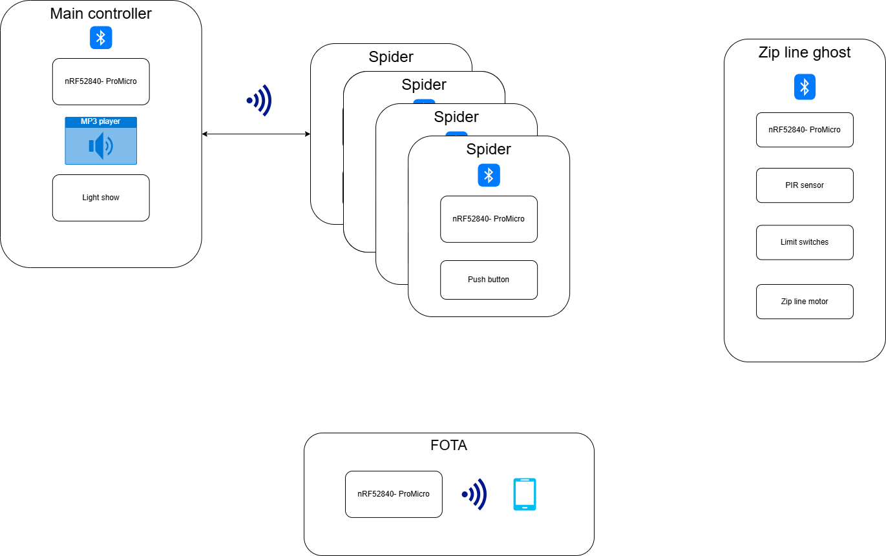

# Description
This is the third generation of our Halloween expo, hosted in the basement. Visitors step into a pitch-dark space filled with eerie music to set the mood. Their mission is to hunt for spiders — but only one spider at a time reveals itself. Each spider has a small light that turns on in a predefined order, guiding visitors through the experience step by step. When a spider is found and its button is pressed, a frightening sound effect and a spooky light show are triggered.

This sequence repeats with each spider until the visitors reach a PIR sensor, which unleashes a ghost racing along a zip line, accompanied by terrifying noises. Finally, a guiding light leads them to a bucket of candy as their sweet reward for surviving the haunted adventure.

# Project overview

  

# Build
NCS 3.1.0 in vscode.
Add build configuration for the nRF52840dk_nrf52840 and use the overlay promicro_nrf52840_ghostzipline.overlay

# MP3 files
For the ghost zip line, the mp3 file(s) can be found on the SD-card. Backup is kept: \\nasen\music\halloween\ghost-zip-line
For the main controller, the mp3 files can be found on the SD-card. Backup is kept: \\nasen\music\halloween\main-controller\mp3
For the trailer, mp3 files are kept: \\nasen\music\halloween\soundtrack. These are used and generated using the python script in /applications/mp3_mixing

